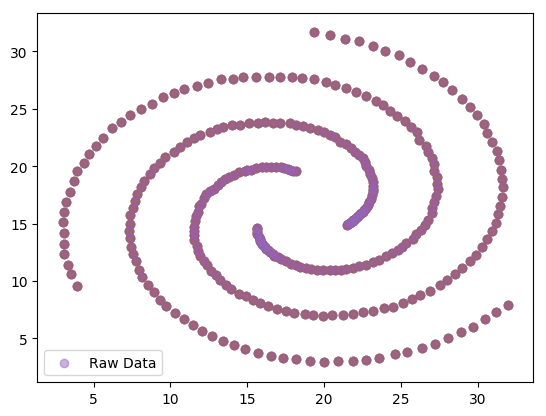
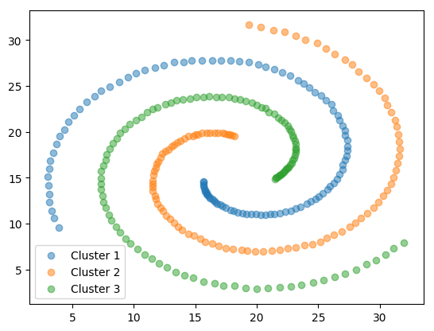

CMSC 5724 - Project
===========
## DBSCAN Classification
Alex, Kam Yiu Wing 1155030595

Ben, Lei Wenfeng 1155002533

Calvin, Ng Wing Hin 1155106860

Forte, Sit King Lok 1155018940

## Background

In this project we are required to partition the given dataset into 3
clusters with DBSCAN algorithm.

## Data Overview
The given data consists of 312 points in a two-dimensional plan:

By simple observation the dataset should have 3 spirals as clusters.

## Result
We used our implementation of DBSCAN to cluster the dataset.

After some tuning we managed to partition the dataset into 3 clusters
with _radius_ = 3, _minPts_ = 5:

